# FS43-Buffalo-SWAT

A Python desktop application (CustomTkinter/Tkinter) for configuring, running, and visualizing **wetland degradation/restoration and land-cover scenarios** on top of an already-calibrated SWAT2012 hydrological model.

The app is an orchestration layer around the external `swat2012.exe` engine — it does not simulate hydrology, recalibrate anything, or reimplement SWAT physics. Its job is:

1. Let the user define a scenario by editing wetland/land-cover parameters on an isolated copy of the model configuration.
2. Run `swat2012.exe` as a local subprocess on that copy.
3. Read the model outputs and visualize them (flow, sediment, nutrients), including comparisons across scenarios.

All screenshots below are from a real project (`Crooked/BaseLine`, 22 subbasins, 1518 HRUs) — no mocked or synthetic data.

## Setup

- Python 3.x, conda environment `swat`.
- Key dependencies: `customtkinter`, `matplotlib`, `pyshp`, `pandas` (plus the standard library `sqlite3`).
- Run with:

  ```
  python main.py
  ```

- The path to `rev670_64rel.exe` is configured inside the app (Run tab) and persisted locally — it is never hardcoded.

## The interface

The app opens with a single window and a row of tabs across the top. Tabs stay disabled until a project (any folder containing `TxtInOut/` directly) is opened from the **Project** tab; from there they follow the natural workflow: configure the scenario (Wetlands, HRUs, NbS) → run it → look at results, with Batch Scenarios at the end since it orchestrates everything else in a series.

## Tabs

### 1. Project

The entry point: open or switch the active project folder (any folder that contains `TxtInOut/` directly — a calibrated reference model or a scenario copy, the app does not currently distinguish between them, see the isolation note below). You can edit the project's name/description, and, in a separate card, point to the **subbasin and reach shapefiles** (`.shp`, via `pyshp` — no GDAL/geopandas dependency) that the Results tabs use to draw their small locator maps. Everything here is metadata only — opening a project never modifies `TxtInOut/` — and is cached in a `project.json` file written next to it, so shapefile paths and the last summary results survive between sessions.

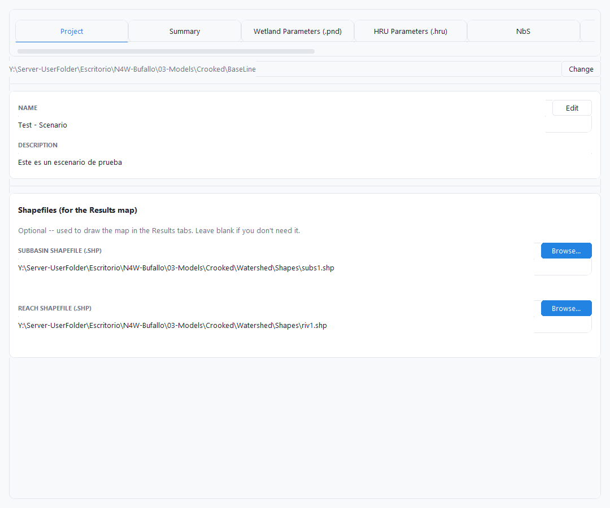

### 2. Summary

The place to consult the state of the model at a glance, without opening any output file by hand. Running it (or reopening a project where it already ran) shows two cached blocks read straight from the real input files:

- **Wetlands** — subbasin count, total watershed area (km²), wetland area (ha), wetland coverage (%), and how many subbasins actually have a wetland defined — computed from the real `.pnd` files, not from `.sub`.
- **HRU / Land Use** — total HRU count, number of distinct land-use classes present, and the simulated period (start/end year, read from `file.cio`).
- **Land Use by Subbasin** — a bar chart of % of area per land-use class, switchable between the whole watershed and any single subbasin, built from a `land_use_by_subbasin.csv` the app generates in `tool_outputs/`.

Both blocks are independent checkboxes (on by default) so you can regenerate just one; results stay cached in `project.json` until you run it again.

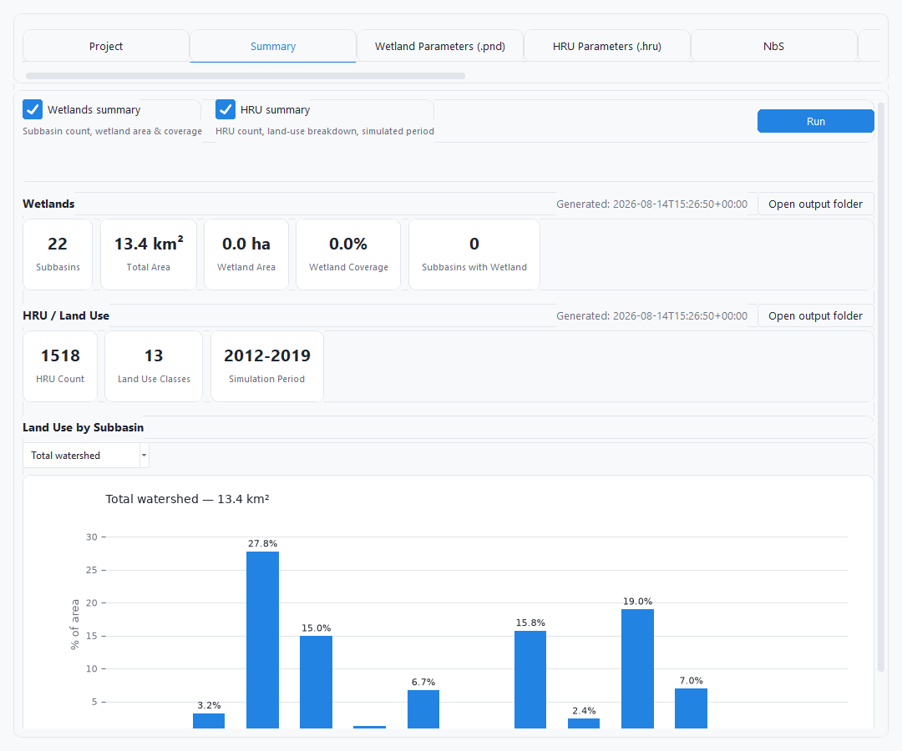

### 3. Wetland Parameters (.pnd)

Where you inspect and edit the wetland configuration of every subbasin. The table shows the 20 "Wetland inputs" parameters as rows against subbasins as columns — `WET_FR` (fraction of the subbasin draining to the wetland), normal/maximum area and volume (`WET_NSA`/`WET_NVOL`, `WET_MXSA`/`WET_MXVOL`), initial volume (`WET_VOL`), bottom hydraulic conductivity (`WET_K`), sediment (`WET_SED`, `WET_NSED`), N/P settling rates (`PSETLW1/2`, `NSETLW1/2`), and water-quality state (`CHLAW`, `SECCIW`, `WET_NO3`, `WET_SOLP`, `WET_ORGN`, `WET_ORGP`, `WETEVCOEFF`) — read live from the real `.pnd` files, never from a cache. Clicking a subbasin's column header (or selecting it and using "Edit in .pnd") opens a full editor with a confirmation step before writing. For changing many subbasins at once, "Load CSV" validates a CSV shaped like the Summary tab's `wetland_summary.csv` export and stages it in memory (marked with `*` in the table) without touching disk — only "Materialize to SWAT" writes the real files.

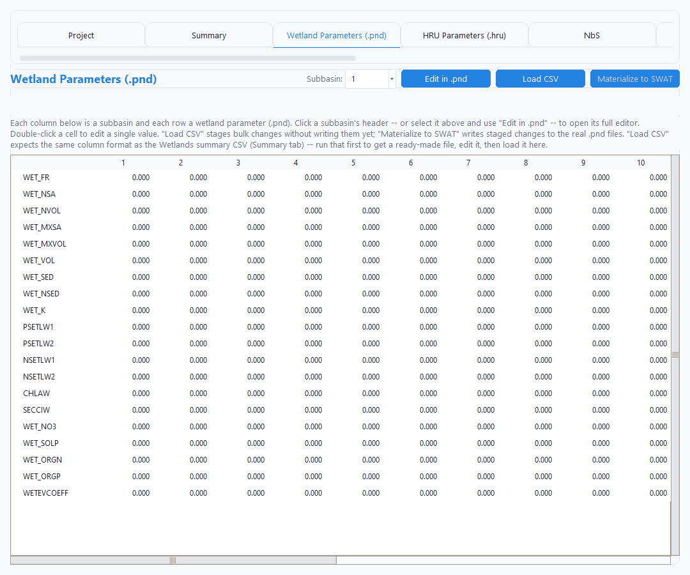

### 4. HRU Parameters (.hru)

Same editing pattern as Wetlands, but scoped one subbasin at a time, since a subbasin can have dozens of HRUs instead of a single wetland record. Rows are HRUs, columns are **every parameter the `.hru` parser recognizes** — there is no curated list here (unlike Wetlands' fixed 20 fields): `HRU_FR`, `SLSUBBSN`, `HRU_SLP`, `OV_N`, `LAT_TTIME`, `CANMX`, `ESCO`, `EPCO`, `RSDIN`, and so on, exactly as they appear in the file. A running `HRU_FR` sum for the visible subbasin is shown next to the selector — it should stay close to 1.0, and turns amber if it drifts, though the app never blocks saving on it. You can double-click an HRU's id for the full editor, double-click any other cell to edit that value inline, "Export CSV" to get a ready-to-edit template of the visible subbasin, and "Load CSV" + "Materialize to SWAT" for bulk edits (staged in memory first, written all-or-nothing per HRU in a background thread).

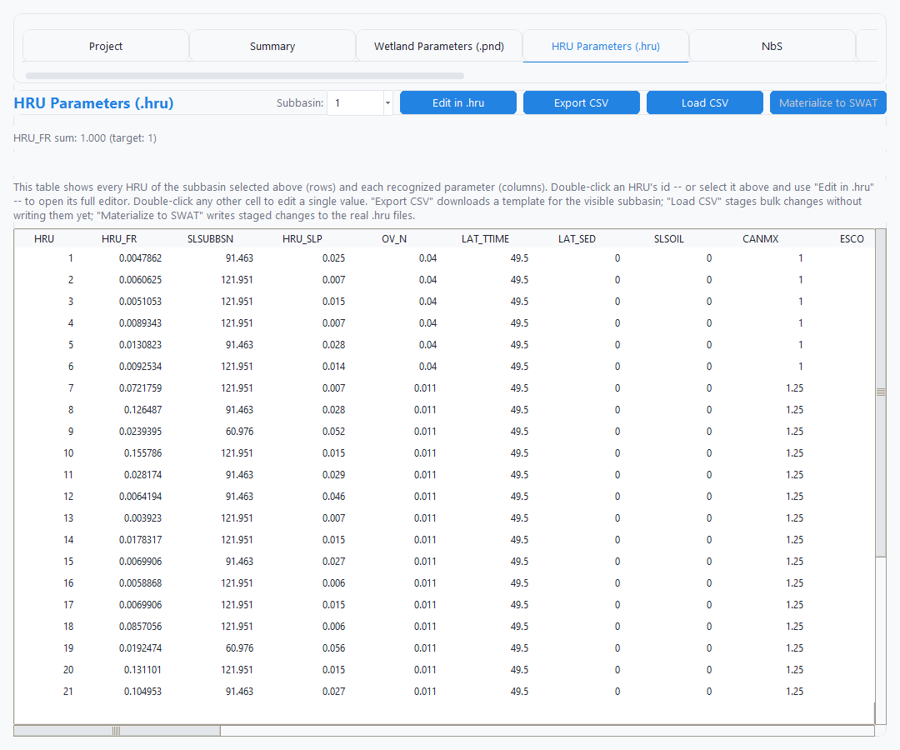

### 5. NbS (Nature-based Solutions)

Where you design a reusable land-cover change once and apply it to as many HRUs as you want. A single NbS bundles everything SWAT needs for a coverage change to actually take effect — plant physiology (`plant.dat`, only if it's a brand-new coverage), `.hru` surface parameters (`CANMX`, `OV_N`, `RSDIN`), the `.mgt` initial condition (`IGRO`, `LAI_INIT`, `BIO_INIT`, `PHU_PLT`) plus `CN2` **per hydrologic soil group** (since the same NbS will land on HRUs with different soils), and the full management operation calendar — never just a bare `PLANT_ID`. A wizard walks through building one, optionally copying real parameter combinations already observed on existing HRUs of the target coverage instead of typing values from scratch.

Once a library of NbS exists, you can apply one to real HRUs three ways: pick subbasin + HRU list by hand, give a target area (ha) in one subbasin split across source coverages by priority, or a CSV matrix giving a target area per subbasin across the whole watershed at once. All three write directly to the real `.hru`/`.mgt`/`plant.dat` — with confirmation and in a background thread — and each HRU is applied all-or-nothing, so one bad HRU never aborts the rest of the batch.

Every Apply streams a line per HRU into a live log as it runs, and automatically opens a results window when it finishes: a table with every HRU's outcome (subbasin, HRU, status, resulting `HRU_FR`, and the error message if it failed), an "errors only" filter, and a link to the CSV audit report — so a large batch can be checked for problems at a glance instead of scrolling a text log or opening the CSV by hand.

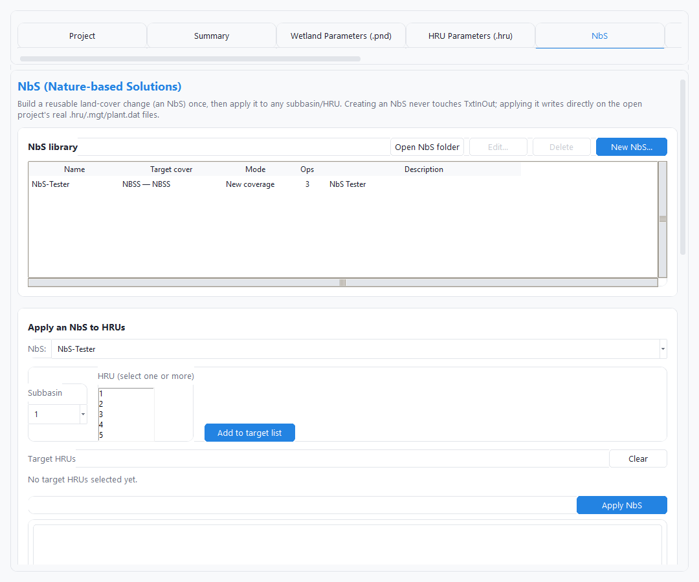

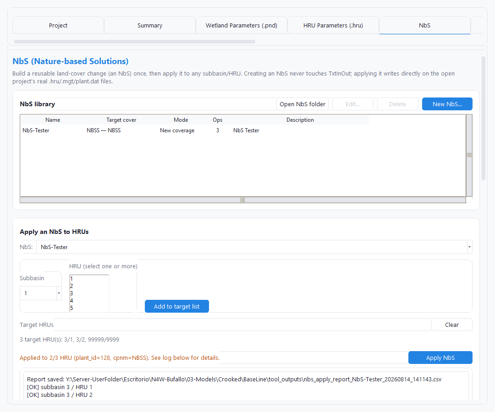

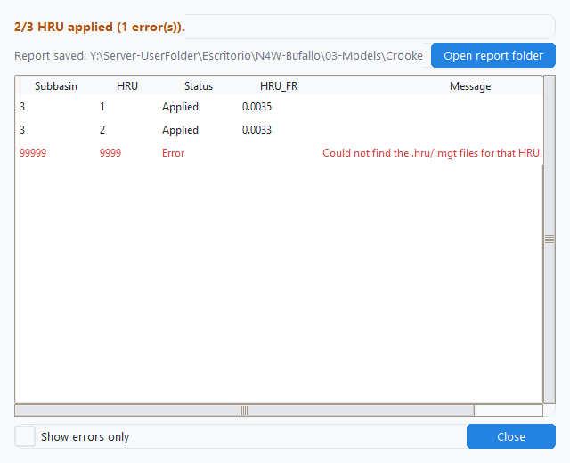

### 6. Restoration Inputs

Where you turn two rasters into the area/coverage CSV that "Apply an NbS by area (all subbasins)" and the NbS area batch expect, instead of typing it by hand: a land-cover raster (can be arbitrarily large — verified against a real ~15 GB, uncropped-to-continent Cropland Data Layer) and a categorical restoration/NbS raster (e.g. classes like "potential wetland area only"). Both get reprojected on the fly to the subbasin shapefile's coordinate system — always the authoritative one, since that's what the SWAT model is actually built on — at whichever of the two rasters has the finer pixel size. The work is bounded to the intersection of the subbasins and the restoration raster's own extent before anything is read, and processed in blocks through a `WarpedVRT`, so the giant land-cover raster is never loaded whole or written back out reprojected: the real-data run above completed in under 2 seconds.

**Scan** reads a fast, decimated sample of both rasters to find which restoration classes and land-cover codes actually exist in the project's area — including real class names when the restoration raster carries a GDAL Raster Attribute Table (`.aux.xml`) sidecar. **Compute** then runs the same cross-tabulation at full resolution and writes one CSV per restoration class to `tool_outputs/restoration_inputs/`, each row giving a subbasin's total restoration area (ha) and the % of it under each land-cover code.

The land-cover crosswalk (mapping a raw code like `141` to a real project coverage like `FRSD`) is entirely optional — Compute never waits on it. An unmapped code is still computed, just under its own raw number as the column name instead of a coverage name; only an explicit "(skip)" choice excludes a code's area on purpose. Mapping codes only matters when you want the output to load directly into "Apply an NbS by area", which needs real coverage names as columns.

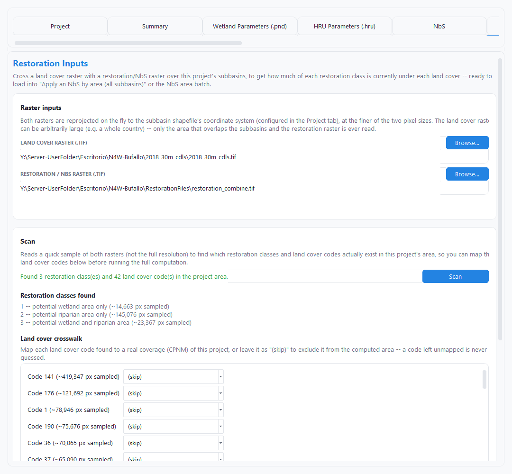

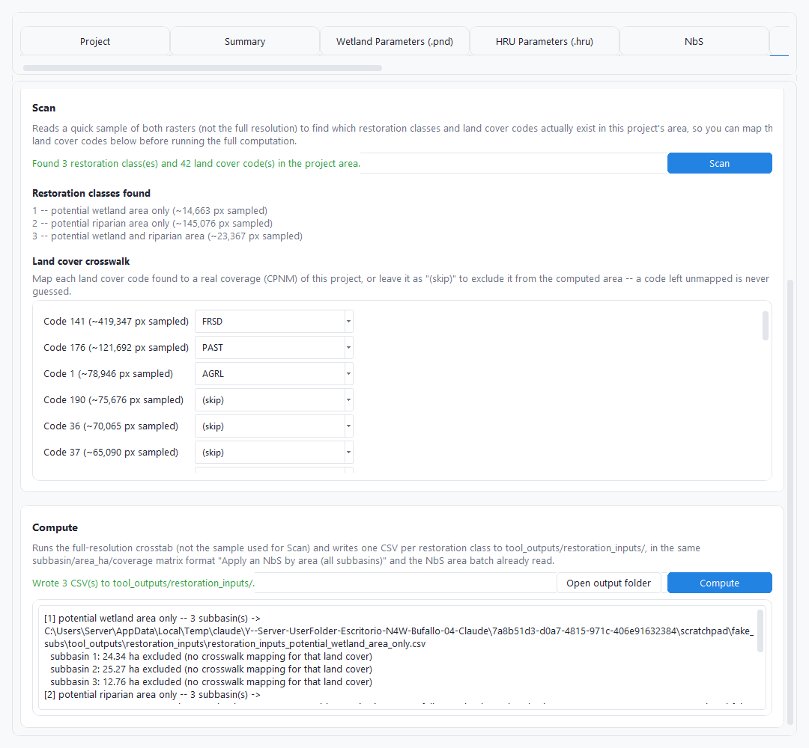

### 7. Run

Where you configure and trigger an actual SWAT run. The top card holds the one path this app needs configured per machine: the `rev670_64rel.exe` executable (validated before it can be used). The "Simulation Period" card exposes the `file.cio` fields that matter for a single run without opening the raw file — start/end year (`NBYR`/`IYR`), warm-up years excluded from output (`NYSKIP`), and print frequency (`IPRINT`: Daily/Monthly/Yearly) — each editable with its own confirmation step.

"Run scenario" copies the configured executable into the project's `TxtInOut/` (under the name `file.cio` expects, never renaming your original file) and runs it as a subprocess, streaming stdout/stderr into the log box below in real time as SWAT prints. Success or failure is read purely from the process exit code — the app never guesses from the contents of `output.std`.

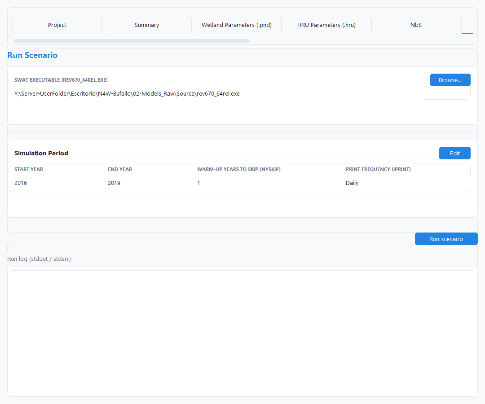

### 8. Results (output.rch)

Where you consult reach-level outputs after a run: flow and loads per stream reach, across all **47 variables** SWAT2012 rev670 writes to `output.rch` (flow, sediment, organic/mineral N and P, pesticide, dissolved oxygen, and more). "Organize .rch" parses the file once, reconstructs real calendar dates from the run's period/frequency in `file.cio`, and writes one time-series CSV per reach into `tool_outputs/rch_timeseries/` — reopening the project later reads that cache instead of reparsing. Pick a reach and a variable to plot its time series; the small map (built from the shapefiles configured in Project) highlights the selected reach among all subbasins/reaches — it's static, there's no click-to-select on the map itself.

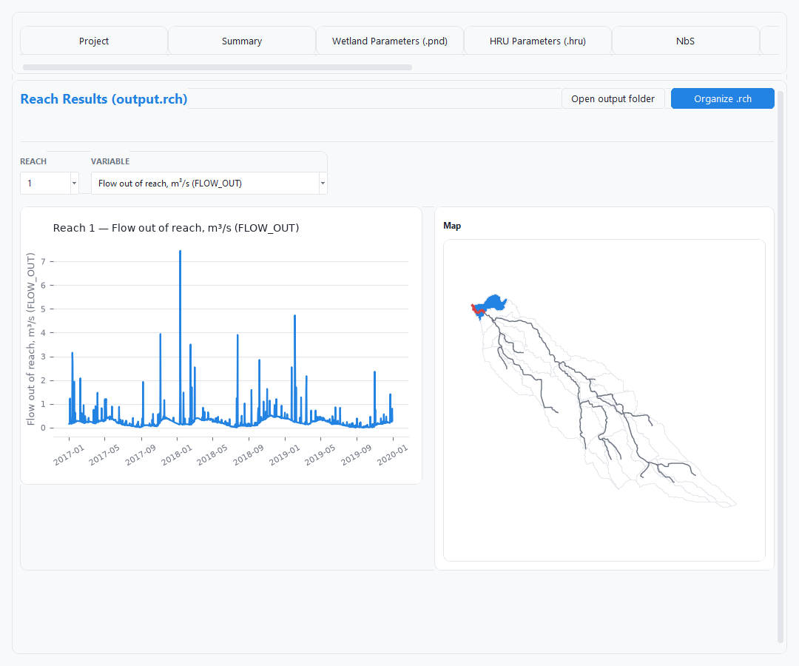

### 9. Results (output.sub)

The same idea as `.rch`, but for the **subbasin water balance** in `output.sub` (24 variables — precipitation, ET, surface/lateral/groundwater flow contributions, sediment yield, etc.) instead of reach routing. "Organize .sub" caches one CSV per subbasin the same way, and the map highlights the selected subbasin polygon instead of a reach.

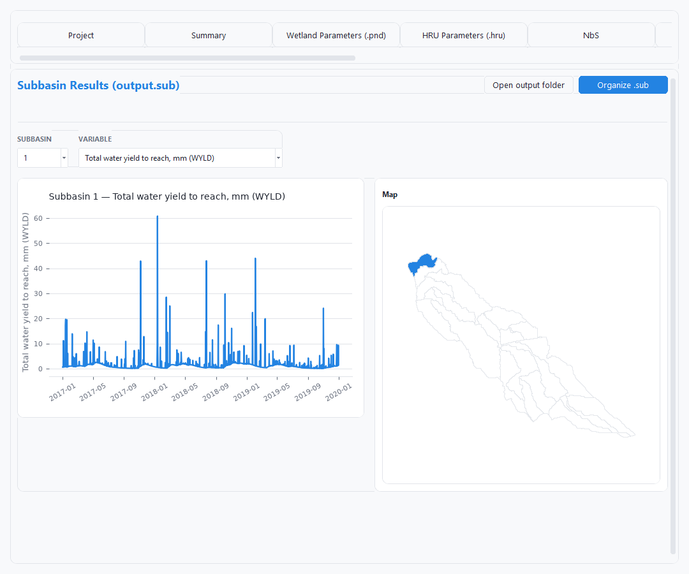

### 10. HRU Results (output.hru)

The most detailed output level: the HRU water/nutrient balance, with **80 variables** per HRU. `output.hru` in Daily mode can be well over 1 GB across thousands of HRUs, so instead of CSVs "Organize .hru output" streams it straight into a local SQLite database (`tool_outputs/hru_timeseries.db`) — the app never loads the full file, or even a full HRU's series, into memory at once; every chart and export queries the database on demand. Pick a subbasin, then an HRU within it, then a variable, and the chart updates immediately. Four export options cover the common cases without hand-picking columns: the single series shown, one variable for every HRU in the visible subbasin (wide CSV, one column per HRU), every variable for the visible HRU, or a checklist of specific variables you pick.

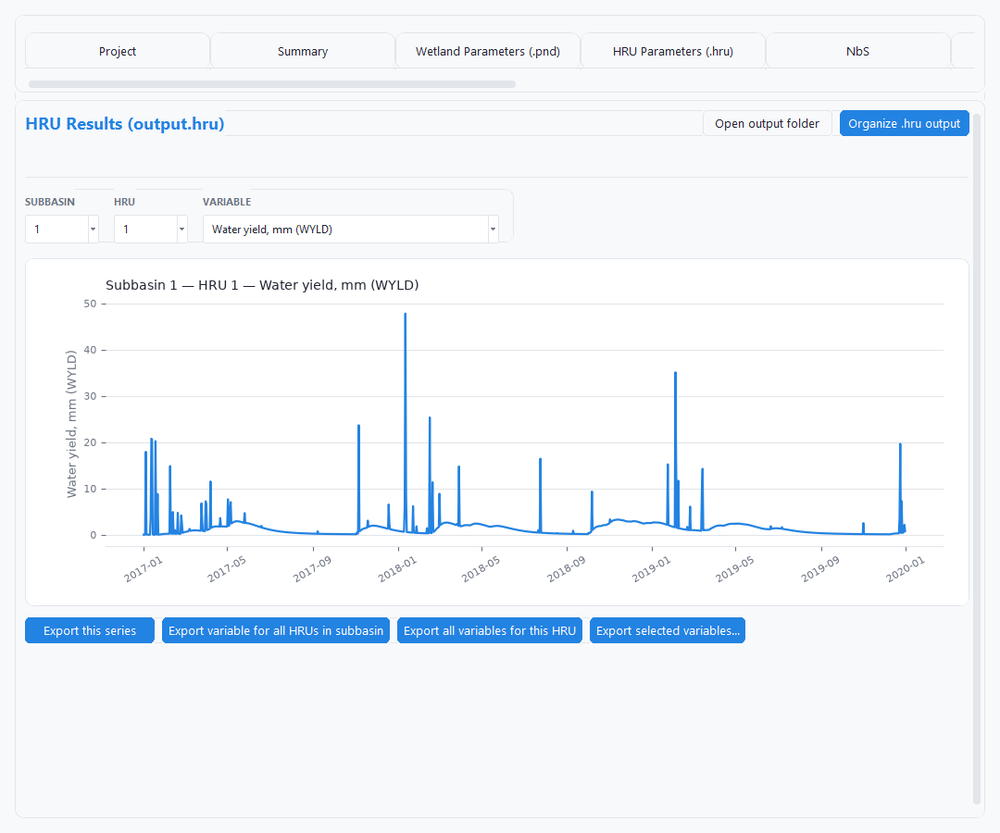

### 11. Batch Scenarios

Where you run a whole series of scenarios unattended against the open project, kept fixed as the reference. It holds two independent engines, stacked as two cards in the same tab — each step of either one copies the reference project into its own folder, runs a full `swat2012.exe` on that copy, and (per checkboxes you control) organizes `output.rch`/`.sub`/`.hru` automatically afterward.

**Land-cover percentage series** (top card): grow a target coverage to 10%, 20%, 30%... of each subbasin's area, reassigning `HRU_FR` from donor coverages by a configurable priority cascade (coverage → slope → soil). Only `HRU_FR` is touched, never any other calibrated parameter, and a subbasin with no HRU of the target coverage — or already above the requested %— is skipped rather than forced. "Download template" scans the open project and writes a CSV with the coverages/slopes/soils that actually exist in it, ready to edit.

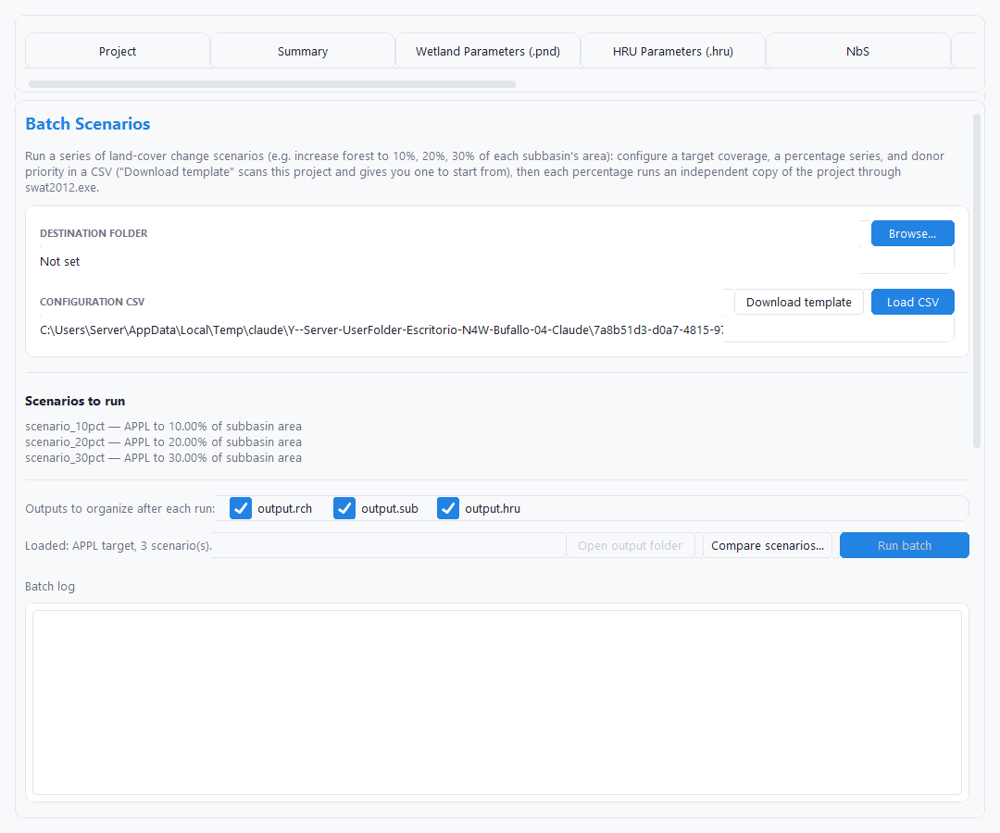

**NbS area batch** (second card, below it in the same scrollable tab): the batch version of the NbS tab's "Apply an NbS by area (all subbasins)" — you give the *same* `subbasin, area_ha, <source coverages>` CSV matrix (the area a 100% step should target per subbasin, and which existing coverages it should come from), pick an NbS from the library, and a percentage series (e.g. `10,20,...,100`); each step scales that area to its percentage and runs independently from the reference project, never chained. Unlike the NbS tab's own Apply-by-area, a step here is never blocked by a shortfall — it applies whatever is achievable with the assigned source coverages and documents the deficit, both in the live log and in a per-step `nbs_area_batch_report.csv`.

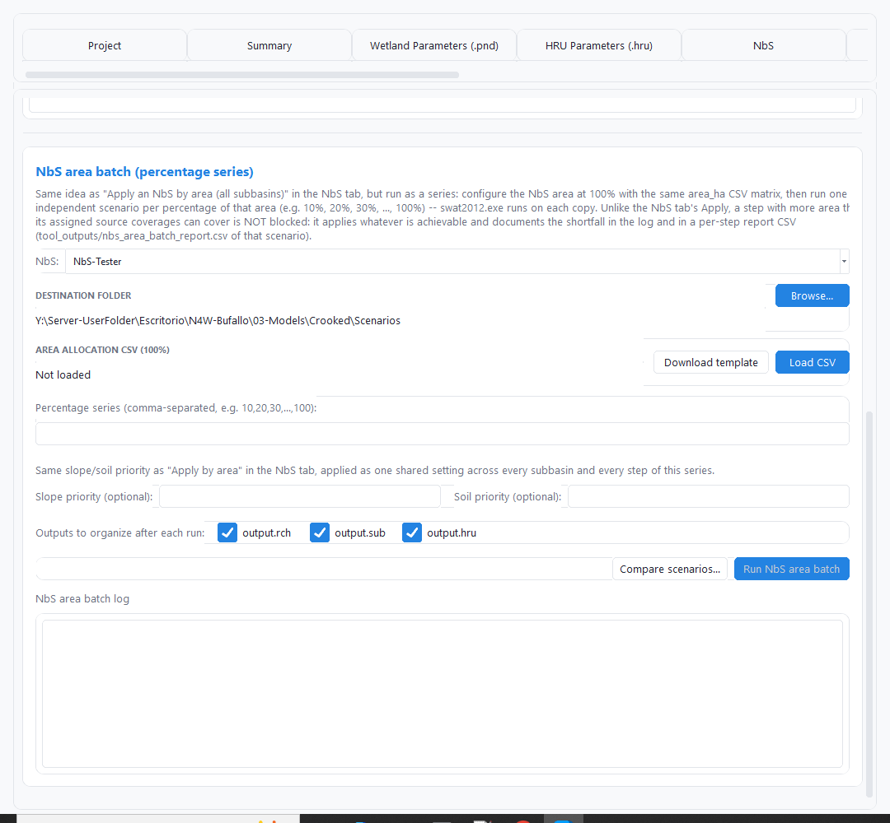

Both cards write a per-step CSV report plus a summary CSV across the whole series (subbasins/HRUs touched, area or % achieved, any deficit), so you can see how a batch went without opening every scenario folder. Once a batch exists (from either card, this run or a previous one), each card's own "Compare scenarios..." opens a window that pulls the same reach/subbasin/HRU variable across every scenario into a single CSV, one column per scenario — RCH and SUB always cover the whole watershed, while HRU can target one specific HRU or a group filtered by coverage/slope/soil and aggregated (sum or area-weighted mean, configurable per variable).

## Notes

- **Scenario isolation is not enforced by the app yet.** Wetlands/HRU Parameters/NbS Apply/Run all write in place on whatever project folder is currently open — including a calibrated reference model, if you point the app at one directly. Treat opening a reference folder as "at your own risk" until an isolation guard is added; Batch Scenarios already works around this by always copying the reference project before writing anything.
- This is purely a text-file orchestration layer: no SWAT Editor automation, and no `.mdb` (SWATGDB/SSURGO) reading or writing anywhere.
- The compute engine is fixed at SWAT2012 rev670 (`rev670_64rel.exe`); the app never modifies or reimplements the hydrology it computes.
